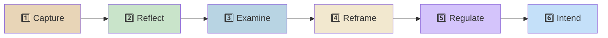
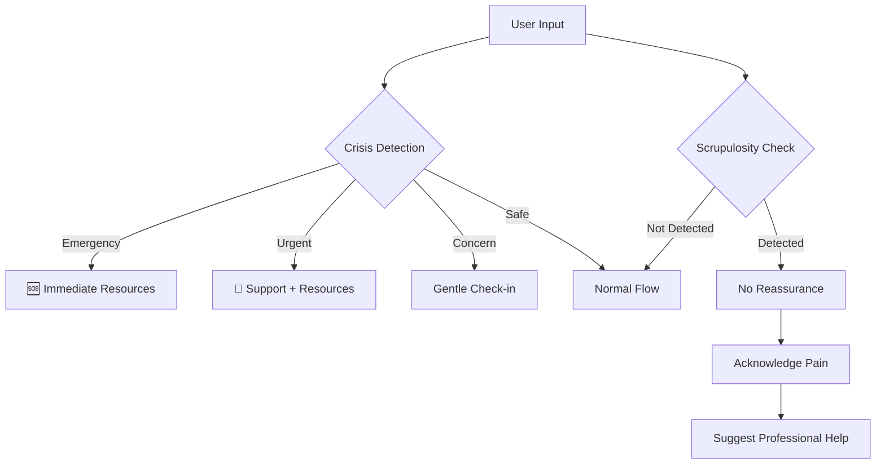

<div align="center">


# ✨ Noor CBT

**Where Psychology Meets Spirituality**

نُور (Noor) • Arabic for "Light"

[](https://opensource.org/licenses/MIT)
[](http://makeapullrequest.com)
[](https://expo.dev/)
[](https://www.typescriptlang.org/)
[](https://nodejs.org/)

[Features](#-features) • [Demo](#-demo) • [Installation](#-installation) • [Architecture](#-architecture) • [Contributing](#-contributing) • [Roadmap](#-roadmap)

---

*Structured thinking for Muslims whose minds feel noisy, circular, or spiritually conflicted—blending CBT-inspired prompts with the wisdom of Islamic tradition.*

</div>

## 🌙 The Story

> *"Verily, in the remembrance of Allah do hearts find rest."*  
> — Quran 13:28

For too long, Muslim communities have faced a false choice: **seek support** or **keep your faith**. 

Noor dissolves this dichotomy. We don't ask you to leave your deen at the door of clarity. We invite you to bring it in.

## 📊 The Problem

| The Gap | The Reality |
|---------|-------------|
| Most wellness apps are secular by design, culturally blind, and spiritually empty | Many Muslims with personal struggles don't seek support |
| Many Muslims feel they must choose between support or faith | **Religious scrupulosity (waswasa)** goes unaddressed |
| | **Cognitive distortions** are often mistaken for faith issues |

## ✨ Features

### 🧠 CBT-Inspired Reflection
- Cognitive distortion identification
- Belief examination and reframing
- Somatic awareness integration

### 🌙 Islamic Integration
- Quran & Sunnah-informed responses
- Nafs (soul) psychology model
- Niyyah (intention) framework
- Curated duas for emotional states

### 🤖 Adaptive AI
- Emotionally intelligent responses
- Adjusts tone based on distress level
- **Crisis detection** with immediate resources
- **Scrupulosity (waswasa) awareness**

### 🛡️ Safety First
- Real-time crisis language detection
- 988 Suicide Prevention Lifeline integration
- Crisis Text Line (741741)
- Never reinforces OCD patterns

## 🚶 The Journey

A single reflection flows through **6 intentional steps**:



| Step | What Happens | Islamic Element |
|------|--------------|-----------------|
| **Capture** | Express your thought + rate emotional intensity | Body awareness (somatic) |
| **Reflect** | AI identifies cognitive distortions | Gentle, non-judgmental |
| **Examine** | Uncover the belief underneath | "What does this say about my worth?" |
| **Reframe** | View through multiple lenses | Compassionate, Balanced, **Rooted** (Islamic), Zoomed Out |
| **Regulate** | Grounding & breathing exercises | "Return to the One who gave you breath" |
| **Intend** | Set your niyyah going forward | بسم الله • Tawakkul, Sabr, Shukr templates |

## 🖼️ Demo

<div align="center">
<table>
<tr>
<td align="center" width="33%">
<b>Emotional Anchoring</b><br/>
<code>Rate intensity 1-5</code><br/>
<code>Somatic awareness</code>
</td>
<td align="center" width="33%">
<b>Multi-Lens Reframing</b><br/>
<code>💛 Compassionate</code><br/>
<code>🌙 Rooted (Islamic)</code>
</td>
<td align="center" width="33%">
<b>Niyyah Setting</b><br/>
<code>بسم الله</code><br/>
<code>6 intention templates</code>
</td>
</tr>
</table>
</div>

## 🏗️ Architecture

```
noor-cbt/
├── 📱 client/                    # React Native (Expo)
│   ├── screens/                 # Journey screens
│   │   ├── ThoughtCaptureScreen.tsx
│   │   ├── DistortionScreen.tsx
│   │   ├── BeliefInspectionScreen.tsx  ← NEW
│   │   ├── ReframeScreen.tsx
│   │   ├── RegulationScreen.tsx
│   │   └── IntentionScreen.tsx
│   ├── components/              # Reusable UI
│   ├── navigation/              # Stack & Tab navigators
│   ├── hooks/                   # Custom hooks
│   ├── lib/                     # API & utilities
│   └── constants/               # Theme, brand, layout
│
├── 🖥️ server/                    # Express.js API
│   ├── routes.ts                # AI-powered endpoints
│   ├── ai-safety.ts             # Crisis & scrupulosity detection
│   ├── conversational-ai.ts     # Adaptive tone system
│   ├── billing/                 # Stripe integration
│   └── middleware/              # Auth, validation
│
├── 📦 shared/                    # Shared modules
│   ├── schema.ts                # Drizzle ORM schema
│   └── islamic-framework.ts     # Quran, Hadith, Nafs model
│
└── 📝 docs/
    └── IMPLEMENTATION_ROADMAP.md
```

### Tech Stack

| Layer | Technology | Why |
|-------|------------|-----|
| **Mobile** | React Native + Expo | Cross-platform, fast iteration |
| **Language** | TypeScript | Type safety, better DX |
| **Backend** | Express.js | Mature ecosystem, team familiarity |
| **Database** | PostgreSQL + Drizzle | Type-safe ORM, lightweight |
| **AI** | OpenAI GPT-4 | Best quality + custom safety layer |
| **Payments** | Apple/Google IAP (mobile) + Stripe scaffolding | Store-compliant billing for mobile with server-side billing scaffolding |
| **Animation** | Reanimated 3 | Smooth 60fps animations |

## 🛡️ Safety Architecture



### What We Detect
- **Crisis keywords**: self-harm, suicide ideation, hopelessness
- **Waswasa patterns**: repetitive religious doubt, reassurance-seeking
- **Distress levels**: 5-tier system (minimal → crisis)

### What We Do
- ✅ Show resources **before** any other content
- ✅ Adapt AI tone to emotional state
- ✅ Never provide reassurance that feeds OCD cycles
- ✅ Log with PII redaction (HIPAA-compliant)

## ✅ Current Status (2026-01-19)

- **Release stage**: Internal alpha only.
- **Completed**: Core CBT journey, onboarding flow, AI safety orchestration, encryption at rest for reflections, E2E + safety tests (79 passing), EAS build profiles.
- **Pending before public launch**: Legal docs finalized/published URLs, crisis resource verification, data retention deletion implementation, production hosting + monitoring, store assets/screenshots + console setup.

## 🗺️ Roadmap

### ✅ Completed
- [x] Core 6-step reflection journey
- [x] Crisis detection & resources
- [x] Scrupulosity awareness
- [x] Emotional intensity tracking
- [x] Multi-perspective reframing
- [x] Niyyah templates with بسم الله
- [x] Belief examination screen

### 🚧 In Progress
- [ ] Session insights & patterns

## 🤝 Contributing

We welcome contributions from developers, Islamic scholars, mental health professionals, and thoughtful humans!

### Guidelines

1. **Fork** the repository
2. Create a **feature branch** (`git checkout -b feature/amazing-feature`)
3. **Commit** your changes (`git commit -m 'Add amazing feature'`)
4. **Push** to the branch (`git push origin feature/amazing-feature`)
5. Open a **Pull Request**

### Important Notes

| ✅ Do | ❌ Don't |
|-------|---------|
| Prioritize psychological safety | Provide fatawa (religious rulings) |
| Source Islamic content from Quran & authentic hadith | Include weak or fabricated hadith |
| Pass AI outputs through safety validation | Skip the safety layer |
| Write tests for new features | Break existing functionality |

### Code Style

```bash
# Lint your code
npm run lint

# Type check
npm run typecheck

# Run tests
npm run test
```

## 📄 License

This project is licensed under the MIT License - see the [LICENSE](LICENSE) file for details.

## 🙏 Acknowledgments

- The Muslim community for sharing their experiences
- Islamic scholars who reviewed our theological content
- Professionals who guided our reflection approach
- Open source contributors who made this possible

---

<div align="center">

**Built with 💚 for the ummah**

*"Take one step toward Me, I will take ten steps toward you.*  
*Walk toward Me, I will come to you running."*  
— Hadith Qudsi

<br/>


<br/>

[](https://github.com/byteworthy/Noor-CBT)
[](https://twitter.com/noorcbt)

</div>
