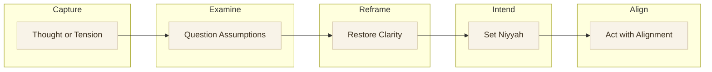
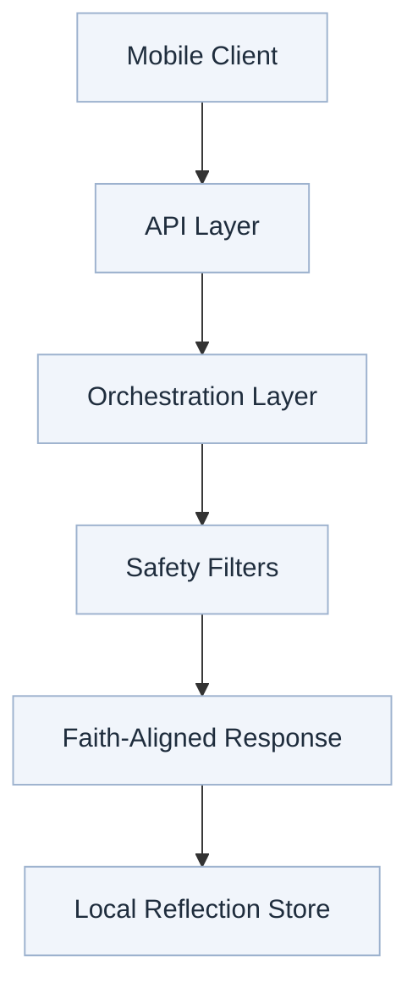

  

# Noor

**Structured thinking for Muslims seeking clarity, intention, and alignment.**

Noor is a faith-aligned thinking companion built to help Muslims slow down their thoughts, examine them carefully, and move forward with intention. It is a structured reflection practice rooted in accountability of thought, clarity of intention, and alignment with Islamic values.

---

## Why Noor Exists

Modern life accelerates reaction. Noor creates space between thought and action. That space is where accountability lives.

---

## Core Experience

Through guided sessions, users:

- Capture a thought or inner tension
- Examine it calmly and honestly
- Reframe it with clarity and perspective
- Close with a deliberate intention

This process mirrors disciplined reasoning while staying grounded in faith, patience, and responsibility.

---

## Reflection Workflow

---

## Faith-Aligned Thinking Practice

Noor operationalizes responsibility for thought, intention, and action.

- Thoughts are examined, not indulged.
- Clarity comes before reaction.
- Intention comes before action.

---

## AI Safety and Guardrails

Noor includes a dedicated safety layer to keep responses respectful, grounded, and aligned with Islamic values. The system is intentionally conservative by design, prioritizing clarity over novelty.

**Guardrail Priorities**

- Faith-aligned tone and language
- Clear boundaries on scope and authority
- Calm, neutral, non-directive responses
- No open-ended generation loops

---

## Technology Overview

Noor is built as a modern mobile-first application with a strong emphasis on reliability, privacy, and clarity.

### Tech Stack

| Layer | Technology |
| --- | --- |
| Mobile App | React Native with Expo |
| Backend | Node.js with TypeScript |
| Data | Local-first storage, Postgres-ready services |
| API Layer | RESTful services |
| Auth | Token-based auth |
| AI Layer | Controlled prompt orchestration |
| Testing | Jest end-to-end and unit tests |
| Tooling | TypeScript, ESLint, Prettier |

---

## Architecture at a Glance

---

## Applications

Noor supports disciplined reflection across everyday situations:

- Clarifying a difficult decision before acting
- Interrupting circular thinking loops
- Reframing assumptions with faith and reason
- Closing a moment of tension with a clear intention

---

## Who Noor Is For

Muslims who:

- Want to think more clearly before acting
- Value faith-aligned accountability
- Prefer structure over endless journaling
- Want intention to guide action

---

## Privacy

- Local-first storage by default
- User-controlled deletion
- Minimal data exposure

---

## Project Status

Noor is in active development with a focus on:

- Core reflection flows
- Stability and testing
- Clean, intentional language
- App store readiness
- Private validation builds

---

## Closing

Noor is intentionally narrow. That focus is its strength.

It exists to help Muslims think more truthfully, act more deliberately, and carry intention into daily life.

**Nothing more. Nothing less.**
